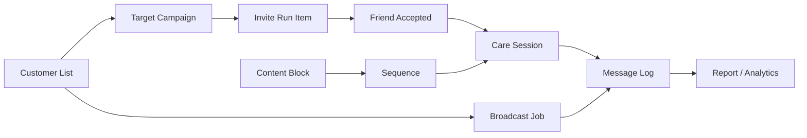
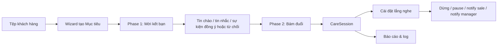
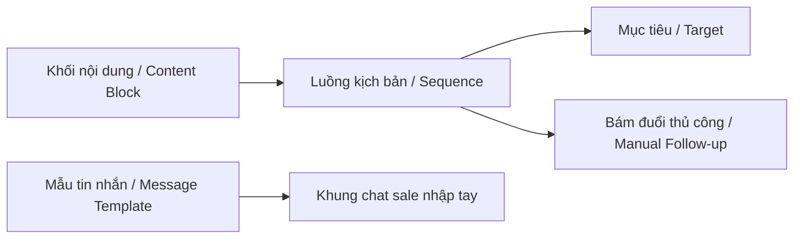

# Phân tích & đề xuất nâng cấp module Marketing

Ngày lập: 12/07/2026  
Dự án: ZaloCRM-CorepViet  
Phạm vi: `/marketing/...` gồm Mục tiêu, Phiên chăm sóc, Luồng kịch bản, Khối nội dung, Mẫu tin nhắn, Broadcast, Tệp khách hàng.

> **CẬP NHẬT TRIỂN KHAI 12/07/2026** — Các lỗi cốt lõi của Phase 3 + Phase 4 đã được fix bằng code
> (worker gửi bước sequence, snapshot nội dung lúc enroll, pause khi khách trả lời, Target tự enroll
> bám đuổi khi khách chấp nhận kết bạn). Chi tiết ở **mục 15 (nhật ký triển khai)**; trạng thái từng
> hạng mục được đánh dấu ngay trong mục 8 và 9 bên dưới. Ký hiệu: ✅ đã triển khai + unit test pass ·
> 🔧 đã triển khai, chờ QA staging · ⏳ làm một phần · ⬜ chưa làm.

---

## 1. Tóm tắt điều hành

Module Marketing hiện đang đi theo đúng hướng: gom các nghiệp vụ kết bạn, chăm sóc, gửi tin hàng loạt và quản lý tệp khách hàng vào một khu vực riêng. Tuy nhiên, qua ảnh màn hình, tài liệu đính kèm và code hiện tại, vấn đề chính không nằm ở giao diện đơn lẻ mà ở kiến trúc sản phẩm chưa khép kín.

Các màn hình đã có form, bảng, thẻ thống kê và sidebar khá đầy đủ, nhưng nhiều phần đang là "khung chức năng": dữ liệu chưa liên thông xuyên suốt, một số nút còn disabled hoặc thiếu wizard, một số màn hiển thị số liệu 0/static, và ranh giới Community/Enterprise chưa rõ. Nếu triển khai tiếp mà không chuẩn hóa mô hình dữ liệu và luồng automation, hệ thống sẽ dễ phát sinh lỗi kiểu "tạo được nhưng không chạy", "gắn được nhưng không theo dõi được", hoặc "broadcast có job nhưng không truy vết được từng khách".

Đề xuất nâng cấp nên chia làm 4 lớp:

1. Chuẩn hóa phạm vi sản phẩm: Community có gì, Enterprise có gì, không để UI hiển thị chức năng vượt năng lực backend.
2. Chuẩn hóa dữ liệu lõi: List -> Target/Broadcast/Sequence -> CareSession -> MessageLog -> Report.
3. Hoàn thiện engine automation: queue, rate limit, pause/resume, retry, chống spam, dừng khi khách phản hồi.
4. Nâng cấp UX vận hành: wizard rõ bước, preview trước khi chạy, log lỗi từng khách, dashboard trạng thái thật.

---

## 2. Hiện trạng quan sát được

### 2.1. Sidebar Marketing

Ảnh cho thấy sidebar đang có các mục:

- Tạo Mục tiêu mới
- Mục tiêu
- Phiên chăm sóc
- Luồng kịch bản
- Khối nội dung
- Mẫu tin nhắn
- Gửi tin hàng loạt
- Tệp khách hàng

Tài liệu đính kèm lại ghi rõ bản Community ban đầu chỉ có:

- Quét nhóm
- Tệp khách hàng
- Broadcast thủ công/tệp thủ công

Trong code router hiện tại, Community đã mở thêm nhiều mục:

- `/marketing/lists`
- `/marketing/broadcasts`
- `/marketing/content-blocks`
- `/marketing/message-templates`
- `/marketing/sequences`
- `/marketing/targets`

Như vậy sản phẩm đang ở trạng thái "Community mở rộng" nhưng tài liệu/UX vẫn mang ngôn ngữ Enterprise. Đây là nguồn gây nhầm lẫn lớn: người dùng thấy đầy đủ menu nhưng một số màn chưa chạy thật hoặc chưa đủ vòng đời backend.

### 2.2. Khối nội dung

Màn Khối nội dung hiện có:

- Danh sách folder/tag
- Filter theo loại: Mời kết bạn, Gửi tin, Đổi trạng thái
- Card khối có tiêu đề, nội dung, số biến thể
- Nút tạo thư mục, tạo khối

Vấn đề nghiệp vụ:

- Chưa thấy rõ khối nào dùng được trong Sequence/Broadcast/Target.
- Chưa có kiểm tra biến bắt buộc như `{{ten}}`, `{{sdt}}`, `{{nick}}`.
- Chưa có preview theo một khách cụ thể.
- Chưa có versioning nội dung. Khi sửa khối, các luồng đang chạy sẽ dùng bản mới hay snapshot cũ?
- Chưa có trạng thái phê duyệt/draft/public/private rõ ràng.

### 2.3. Bám đuổi khách hàng thủ công

Màn "Bám đuổi khách hàng thủ công" hiện đang trống số liệu:

- Tổng KH gắn tay = 0
- Đang chạy = 0
- Đã hoàn thành = 0
- Đã dừng = 0

Trong các phiên trước đã có lỗi "gắn luồng bám đuổi" không thấy luồng mới tạo, sau đó đã nối lại một phần qua `AutomationSequence` và `CareSession`.

Vấn đề còn lại:

- Cần phân biệt rõ bám đuổi thủ công và bám đuổi tự động từ mục tiêu.
- Cần có detail view cho từng phiên: khách, nick gửi, sequence, bước hiện tại, tin đã gửi, lỗi, lý do dừng.
- Cần có hành động vận hành: tạm dừng, tiếp tục, dừng hẳn, chuyển sale/nick, gửi bước tiếp theo ngay.

### 2.4. Tệp khách hàng

Màn Tệp khách hàng đang là phần có dữ liệu thật nhất:

- Có tổng tệp, nguồn Paste/File/Lead Ads, số SĐT, số có Zalo.
- Có bảng tệp, tiến độ, hợp lệ/trùng/có Zalo.
- Có detail list trước đó đã làm nhiều cột và xử lý scan.

Vấn đề chính:

- Nút Import CSV đang disabled trong ảnh.
- Tệp chưa thấy phân quyền/chia sẻ rõ: ai tạo, ai dùng, ai được chạy campaign.
- Cột "Mã đồng bộ" và "Chia sẻ" hiện đang trống nhiều, cần chuẩn hóa nếu muốn dùng Lead Ads/GetFly/Lark.
- Trạng thái "có Zalo" cần tách rõ:
  - Đã là bạn trong nick nào.
  - Có Zalo nhưng chưa kết bạn.
  - Không tìm thấy.
  - Chưa quét.

### 2.5. Mục tiêu

Màn Mục tiêu có bảng campaign kết bạn + bám đuổi:

- Thống kê đang bật, khách đã vào, hoàn thành, tỷ lệ phản hồi.
- Bảng có phase 1 mời kết bạn và phase 2 bám đuổi.
- Có các trạng thái: Đang chạy, Tạm dừng, Hoàn tất, Hẹn lịch, Nháp, Đã xóa.

Vấn đề:

- Đây là module phức tạp nhất nhưng ảnh cho thấy số liệu phase đang 0/0, chưa chứng minh engine chạy thật.
- Tạo mục tiêu mới cần wizard nhiều bước, nhưng chưa thấy đầy đủ:
  - Chọn tệp khách.
  - Chọn nick gửi.
  - Chọn nội dung mời kết bạn.
  - Chọn sequence sau khi kết bạn.
  - Cấu hình rate limit, khung giờ, dừng khi phản hồi.
  - Preview số lượng hợp lệ trước khi chạy.
- Cần trạng thái từng người nhận trong target, không chỉ tổng số.

### 2.6. Phiên chăm sóc

Màn Phiên chăm sóc hiện có:

- Tab Phiên chăm sóc và Cài đặt lắng nghe.
- Thống kê: vừa trả lời, tạm dừng, đang chăm sóc, đã đóng.
- Danh sách phiên và panel chi tiết bên phải.

Vấn đề:

- Danh sách trong ảnh giống dữ liệu mẫu hoặc dữ liệu chưa nối đủ: nhiều số 0987 000 0xx.
- Panel detail đang yêu cầu chọn phiên, nhưng chưa thấy nội dung phiên.
- "Cài đặt lắng nghe" phải là trung tâm dừng/tạm dừng automation khi khách phản hồi, nhưng chưa rõ đang lưu ở đâu và áp dụng cho sequence nào.

### 2.7. Mẫu tin nhắn

Mẫu tin nhắn hiện có:

- Shortcut kiểu `//cskh`, `//camon`, `//baogia`, `//chao`.
- Folder công khai/cả công ty.
- Filter theo dự án.

Vấn đề:

- Cần nối chắc với khung chat: gõ `//` phải search được nhanh, chọn mẫu và replace biến.
- Cần tách "Template soạn tay" với "Content Block dùng automation". Hai loại giống nhau về nội dung nhưng khác vòng đời:
  - Template: sale dùng thủ công trong chat.
  - Block: automation dùng có snapshot, validation, rate-limit và log.
- Cần thống kê mẫu nào hay dùng, mẫu nào có tỷ lệ phản hồi tốt.

### 2.8. Luồng kịch bản

Màn Luồng kịch bản hiện có:

- Card sequence, bước gửi tin, toggle bật/tắt.
- Counter: đã enroll, hoàn thành, lỗi, đang chạy.
- Luật an toàn như giãn đều giữa nick, dừng khi kết bạn.

Vấn đề:

- Chưa thấy builder trực quan đầy đủ: thêm bước, delay, điều kiện, nhánh, preview.
- Chưa rõ sequence dùng block snapshot hay tham chiếu block live.
- Chưa có thống kê theo bước: bước nào gửi bao nhiêu, lỗi bao nhiêu, reply bao nhiêu.
- Toggle bật/tắt phải ảnh hưởng tới enroll mới hay cả phiên đang chạy? Cần định nghĩa.

### 2.9. Gửi tin hàng loạt

Broadcast hiện có:

- Danh sách job, trạng thái nháp/hẹn lịch/hoàn tất.
- Tiến độ gửi, tỷ lệ thành công, lỗi, thời gian.
- Backend đã có route và cron cho broadcast.

Vấn đề:

- Nút Import Excel trong ảnh đang disabled.
- Cần wizard soạn broadcast đầy đủ và an toàn:
  - Chọn tệp hoặc bộ lọc.
  - Chọn nick gửi.
  - Chọn nội dung/media.
  - Preview biến.
  - Ước tính số người nhận.
  - Cảnh báo người lạ/chưa kết bạn.
  - Cấu hình tốc độ gửi.
- Cần log từng người nhận: sent/failed/skipped, lý do, retry.
- Cần chống gửi trùng theo cùng khách/cùng campaign.

---

## 3. Vấn đề kiến trúc cốt lõi

### 3.1. Ranh giới Community/Enterprise chưa nhất quán

Tài liệu nói một số tính năng là Enterprise, nhưng UI Community đang mở rộng nhiều mục. Nếu đây là chủ đích sản phẩm mới, cần cập nhật lại tài liệu và đổi cách đặt tên:

- Community Lite: List + Broadcast + Template + Manual Sequence.
- Enterprise: Target automation, care-session engine nâng cao, listening rules, bot auto, analytics nâng cao.

Nếu không phải chủ đích, cần ẩn menu Enterprise hoặc hiển thị banner "sắp ra mắt" rõ ràng.

### 3.2. Dữ liệu chưa có một lifecycle thống nhất

Hiện các đối tượng đang rời rạc:

- List là nguồn khách.
- Target chạy kết bạn.
- Sequence chạy bám đuổi.
- Broadcast gửi hàng loạt.
- CareSession theo dõi chăm sóc.
- MessageTemplate/Block là nguồn nội dung.

Cần định nghĩa lifecycle chuẩn:



### 3.3. Thiếu lớp snapshot nội dung

Automation không nên dùng nội dung live trực tiếp. Khi campaign/sequence bắt đầu, cần snapshot:

- Nội dung tin nhắn.
- Media đính kèm.
- Biến thay thế.
- Runtime rules.
- Người tạo/người duyệt.

Nếu sau này sửa template/block, phiên đang chạy không bị đổi bất ngờ.

### 3.4. Thiếu trạng thái chi tiết từng khách

Các bảng tổng có phần trăm, nhưng vận hành thực tế cần biết từng khách đang ở đâu:

- pending
- queued
- sending
- sent
- failed
- skipped
- replied
- stopped
- completed

Mỗi trạng thái cần có `reason`, `lastError`, `attemptCount`, `nextRunAt`.

### 3.5. Cần chuẩn hóa chống spam và an toàn nick

Marketing qua Zalo rất nhạy. Engine cần có tầng an toàn bắt buộc:

- Giới hạn số tin/ngày/nick.
- Giới hạn số lời mời kết bạn/ngày/nick.
- Khung giờ gửi.
- Random delay.
- Pause khi nick mất kết nối.
- Pause khi bị rate limit.
- Dừng khi khách phản hồi.
- Không gửi lại cùng nội dung cho cùng khách trong khoảng thời gian cấu hình.

---

## 4. Đề xuất mô hình dữ liệu nâng cấp

### 4.1. ContentBlock

Mục đích: đơn vị hành động tái sử dụng.

Trường đề xuất:

- `id`
- `orgId`
- `folderId`
- `type`: `send_message`, `friend_request`, `change_status`, `wait`, `assign_tag`
- `name`
- `body`
- `mediaIds`
- `variables`
- `variants`
- `visibility`: `private`, `team`, `org`
- `status`: `draft`, `active`, `archived`
- `version`
- `createdById`
- `updatedAt`

### 4.2. MessageTemplate

Mục đích: mẫu sale chèn nhanh trong chat.

Trường đề xuất:

- `id`
- `orgId`
- `shortcut`
- `name`
- `body`
- `projectTags`
- `folderId`
- `visibility`
- `usageCount`
- `lastUsedAt`

### 4.3. AutomationSequence

Mục đích: chuỗi bước bám đuổi.

Trường đề xuất:

- `id`
- `orgId`
- `name`
- `description`
- `enabled`
- `stepsSnapshot`
- `runtimeRules`
- `statsCached`
- `createdById`

Step chuẩn:

```json
{
  "order": 1,
  "type": "send_message",
  "blockId": "optional",
  "delay": { "amount": 2, "unit": "hour" },
  "contentSnapshot": {
    "body": "Em chào {{ten}}...",
    "mediaIds": []
  },
  "stopRules": {
    "stopOnReply": true,
    "stopOnFriendAccepted": false
  }
}
```

### 4.4. CareSession

Mục đích: trạng thái chăm sóc của một khách trong một luồng.

Trường đề xuất:

- `id`
- `orgId`
- `contactId`
- `friendId`
- `zaloAccountId`
- `sourceType`: `target`, `manual`, `broadcast_followup`
- `sourceId`
- `sequenceId`
- `status`: `running`, `paused`, `completed`, `stopped`, `failed`, `replied`
- `currentStepIndex`
- `nextRunAt`
- `lastMessageAt`
- `lastReplyAt`
- `stopReason`
- `error`
- `rulesSnapshot`

### 4.5. CampaignTarget

Mục đích: campaign mời kết bạn + bám đuổi sau khi kết bạn.

Trường đề xuất:

- `id`
- `orgId`
- `name`
- `listId`
- `zaloAccountIds`
- `inviteBlockSnapshot`
- `followupSequenceId`
- `status`: `draft`, `scheduled`, `running`, `paused`, `done`, `deleted`
- `sendWindow`
- `rateLimit`
- `statsCached`

Target item:

- `targetId`
- `listEntryId`
- `contactId`
- `phone`
- `zaloUid`
- `status`
- `friendRequestSentAt`
- `acceptedAt`
- `careSessionId`
- `lastError`
- `attemptCount`

### 4.6. BroadcastJob

Backend đã có route/cron, nên cần chuẩn hóa UI và log.

Trường bổ sung nên có:

- `audienceSnapshot`
- `contentSnapshot`
- `mediaSnapshot`
- `dedupeKey`
- `approvalStatus`
- `dryRunStats`
- `lastRunSummary`

---

## 5. Nâng cấp theo từng màn hình

### 5.1. Marketing Shell

Việc cần làm:

- Thống nhất route và tên menu:
  - Nếu route là `/marketing/content-blocks`, menu vẫn có thể ghi "Khối nội dung", nhưng code/tài liệu cần map rõ.
  - Nếu tài liệu ghi `/marketing/blocks`, cần redirect hoặc alias.
- Thêm edition badge:
  - Community
  - Community Plus
  - Enterprise
- Ẩn hoặc khóa mềm tính năng chưa hỗ trợ.
- Thêm breadcrumb nhất quán cho mọi màn.

Acceptance criteria:

- Người dùng không bấm vào màn chưa có backend thật mà tưởng đã chạy.
- Mỗi menu có route, permission và trạng thái sản phẩm rõ.

### 5.2. Tệp khách hàng

Ưu tiên nâng cấp:

1. Bật Import CSV/Excel.
2. Chuẩn hóa preview trước import.
3. Dedupe theo phone normalized.
4. Tách trạng thái Zalo:
   - `unknown`
   - `has_zalo`
   - `no_zalo`
   - `already_friend`
   - `pending_friend`
5. Thêm action tạo Broadcast/Target từ tệp.

Acceptance criteria:

- Import 1 file 1.000 dòng không treo UI.
- Sau import thấy số hợp lệ/trùng/lỗi.
- Có thể mở detail và sửa từng dòng.
- Có thể chọn tệp để chạy broadcast hoặc target.

### 5.3. Broadcast

Ưu tiên nâng cấp:

1. Hoàn thiện wizard 4 bước.
2. Thêm dry-run: tính số người nhận trước khi gửi.
3. Thêm log từng người nhận.
4. Thêm retry có giới hạn.
5. Thêm pause/resume/job detail.
6. Cảnh báo rủi ro khi gửi người lạ/chưa kết bạn.

Acceptance criteria:

- Tạo job nháp không gửi ngay.
- Preview nội dung biến theo khách mẫu.
- Chạy job có progress realtime.
- Mỗi lỗi có lý do rõ: không có UID, chưa kết bạn, nick offline, rate limit, send failed.

### 5.4. Mẫu tin nhắn

Ưu tiên nâng cấp:

1. Nối search `//` trong chat.
2. Thêm folder/tag/project.
3. Thêm biến chuẩn và preview.
4. Thêm thống kê usage.

Acceptance criteria:

- Trong chat gõ `//chao` hiện mẫu.
- Chọn mẫu replace được `{name}`, `{sale}`, `{project}`.
- Admin thấy mẫu nào được dùng nhiều.

### 5.5. Khối nội dung

Ưu tiên nâng cấp:

1. Tạo/sửa block có biến thể.
2. Preview block theo contact.
3. Snapshot block khi đưa vào sequence/target/broadcast.
4. Versioning block.
5. Validate biến thiếu.

Acceptance criteria:

- Block dùng được trong sequence.
- Sửa block không làm đổi phiên đang chạy nếu phiên đã snapshot.
- Biến không có dữ liệu được báo trước.

### 5.6. Luồng kịch bản

Ưu tiên nâng cấp:

1. Builder thêm/sửa/xóa/reorder step.
2. Step types:
   - send message
   - wait
   - change status
   - add tag
   - stop
3. Runtime rules:
   - stop on reply
   - stop on friend accepted
   - send window
   - max step per day
4. Stats theo step.
5. Preview lịch gửi.

Acceptance criteria:

- Tạo sequence gồm nhiều bước.
- Gắn sequence cho khách từ tab Follow-up.
- Worker gửi đúng bước theo `nextRunAt`.
- Khách trả lời thì session dừng/tạm dừng theo rule.

### 5.7. Mục tiêu

Ưu tiên nâng cấp:

1. Wizard tạo mục tiêu 5 bước:
   - Chọn tệp.
   - Chọn nick.
   - Chọn nội dung mời kết bạn.
   - Chọn sequence bám đuổi.
   - Cấu hình tốc độ/khung giờ/preview.
2. Target item log theo từng khách.
3. Phase 1/Phase 2 chạy thật.
4. Thống kê phản hồi.

Acceptance criteria:

- Tạo mục tiêu từ tệp khách hàng.
- Gửi lời mời kết bạn theo rate limit.
- Khi khách đồng ý, tự tạo CareSession nếu có sequence.
- Dừng khi khách phản hồi.

### 5.8. Phiên chăm sóc

Ưu tiên nâng cấp:

1. Danh sách lấy từ `CareSession` thật.
2. Panel chi tiết:
   - Timeline tin đã gửi.
   - Bước hiện tại.
   - Bước tiếp theo.
   - Lỗi gần nhất.
   - Lý do dừng.
3. Action:
   - Pause
   - Resume
   - Stop
   - Send next now
   - Reassign nick/sale
4. Cài đặt lắng nghe cấp org và cấp sequence.

Acceptance criteria:

- Khi khách trả lời, phiên chuyển sang `replied` hoặc `paused`.
- Sale thấy phiên cần xử lý.
- Admin xem được phiên nào lỗi và vì sao.

---

## 6. Kiến trúc backend đề xuất

### 6.1. Module route

Nên gom route theo nhóm:

- `/api/v1/marketing/lists`
- `/api/v1/marketing/blocks`
- `/api/v1/marketing/templates`
- `/api/v1/marketing/sequences`
- `/api/v1/marketing/targets`
- `/api/v1/marketing/broadcasts`
- `/api/v1/marketing/care-sessions`

Hiện có một số route nằm ở:

- `modules/lists`
- `modules/broadcast`
- `modules/target`
- `modules/automation/community-automation-routes.ts`

Không bắt buộc đổi ngay, nhưng frontend nên dùng một lớp service/composable để không phụ thuộc route phân tán.

### 6.2. Worker/Queue

Các worker cần có:

- `broadcast-worker`
- `target-invite-worker`
- `sequence-step-worker`
- `list-enrichment-worker`
- `care-session-listener`

Mỗi job phải idempotent:

- Có `dedupeKey`.
- Có lock theo nick/account.
- Có retry policy.
- Có log audit.

### 6.3. Realtime

Các màn cần realtime:

- Broadcast progress.
- Target phase progress.
- CareSession khi khách reply.
- Nick offline/rate limited.

Socket event đề xuất:

- `marketing:broadcast.updated`
- `marketing:target.updated`
- `marketing:care_session.updated`
- `marketing:sequence.step_sent`
- `marketing:list.enriched`

---

## 7. UX/UI cần cải thiện

### 7.1. Trạng thái nút

Không nên để nút disabled mà không giải thích. Ví dụ:

- Import CSV
- Nhập từ Excel
- Tạo thư mục
- Tạo khối

Mỗi nút cần có một trong ba trạng thái:

- Active: bấm được.
- Disabled có tooltip lý do.
- Coming soon có badge.

### 7.2. Empty state

Các màn đang có empty state nhưng cần CTA rõ:

- Chưa có phiên chăm sóc -> "Tạo sequence" hoặc "Gắn sequence cho khách".
- Chưa có luồng -> "Tạo luồng mới".
- Chưa có tệp -> "Tạo tệp" hoặc "Import CSV".

### 7.3. Preview trước khi gửi

Mọi hành động gửi tin phải có preview:

- Nội dung sau khi replace biến.
- Tên nick gửi.
- Số người nhận.
- Người bị loại/skipped.
- Rủi ro nếu người nhận chưa kết bạn.

### 7.4. Log lỗi thân thiện

Không chỉ hiển thị "lỗi". Cần map lỗi:

- `ACCOUNT_OFFLINE`: Nick chưa kết nối.
- `RATE_LIMITED`: Zalo chặn tốc độ.
- `NOT_FRIEND`: Khách chưa kết bạn.
- `NO_UID`: Không có UID để gửi.
- `SEND_FAILED`: SDK trả lỗi.
- `MEDIA_FAILED`: File/ảnh không tải được.

---

## 8. Roadmap triển khai đề xuất

### Phase 1: Chuẩn hóa sản phẩm và UX cơ bản

Mục tiêu: người dùng không bị nhầm chức năng demo với chức năng thật.

Việc làm:

- Đồng bộ menu Community/Enterprise.
- Thêm badge trạng thái tính năng.
- Bật/hoàn thiện Import CSV.
- Chuẩn hóa route alias `/marketing/blocks` và `/marketing/content-blocks`.
- Tạo service frontend cho marketing API.
- Chuẩn hóa empty state và disabled tooltip.

### Phase 2: Hoàn thiện List + Broadcast

Mục tiêu: chạy được gửi hàng loạt có log và an toàn.

Việc làm (trạng thái cập nhật 12/07/2026 — chi tiết mục 16):

- Wizard broadcast. — ⏳ modal tạo 1 trang đã đủ trường (nguồn/nội dung/lịch/chống block) + nút Đếm KH; chưa tách wizard nhiều bước.
- Dry-run audience. — ✅ endpoint `POST /broadcast-jobs/audience-count`: tổng/sẽ gửi/breakdown skip (không Zalo, chưa quét, cần tra UID) + quota tin/ngày của nick; FE nút "Đếm KH sẽ nhận tin".
- Log từng người nhận. — ✅ đã có từ trước (`BroadcastRunItem` + modal log); bổ sung filter theo trạng thái (queued/sent/failed/skipped).
- Pause/resume/retry. — ✅ pause/resume có sẵn; retry MỚI: `POST .../runs/:runId/retry-failed` tạo run mới chỉ gồm item lỗi + nút "Gửi lại N tin lỗi" trên FE.
- Realtime progress. — ✅ FE poll 15s (có sẵn) + MỚI emit socket `broadcast:updated` tới room `org:{orgId}` sau mỗi tin.
- Báo cáo broadcast. — 🔧 đã có từ trước (`GET /reports/broadcast`: KPI, theo nick, theo tệp, 20 run gần nhất).
- **Snapshot audience (điểm then chốt mục 14.3). — ✅ MỚI: run materialize người nhận thành item 'queued' lúc kích hoạt — sửa tệp/quét lại Zalo giữa chừng không đổi danh sách đang gửi (unit test 5/5).**
- Import CSV (List). — ✅ modal Tạo tệp vốn ĐÃ có tab Upload Excel/CSV đầy đủ (map cột + preview + dry-run); nút "Import CSV" disabled ở header chỉ là nút legacy chưa nối — đã nối mở thẳng tab CSV.
- Tạo Broadcast từ tệp. — ✅ nút "Tạo Broadcast" ở trang chi tiết tệp → mở modal Broadcast với tệp chọn sẵn (mục 14.10).

### Phase 3: Hoàn thiện Block + Template + Sequence

Mục tiêu: tạo nội dung một lần, dùng được cho chat và automation.

Việc làm (trạng thái cập nhật 12/07/2026 — chi tiết mục 15):

- **Mẫu tin nhắn backend Community. — ✅ MỚI 12/07: bản Community trước KHÔNG có route `/automation/templates` (EE-only) → màn Mẫu tin nhắn + chèn `//` trong Chat CHẾT (404). Nối lại `message-template-routes.ts` (CRUD + folder + track-use, map về MessageTemplate) + helpers org-scope (test 12/12 pass).**
- Block versioning/snapshot. — ⏳ một phần: snapshot đã làm ở mức CareSession (`stepsSnapshot` chụp lúc enroll); versioning riêng cho Block chưa. BỔ SUNG 12/07: validate biến `{{...}}` lạ khi lưu Block (chặn gửi token literal cho khách).
- Sequence builder nhiều bước. — ✅ builder thêm/xóa/sửa step + delay + text ĐÃ có; BỔ SUNG 12/07: reorder step (lên/xuống) — thứ tự = thứ tự gửi.
- Preview biến. — 🔧 đã có route `POST /automation/sequences/:id/preview` render theo contact (dùng ở `SequencePreviewDialog` trong Chat).
- Manual attach sequence ổn định. — ✅ enroll ghi `stepsSnapshot` + `currentStepIdx` + `nextRunAt`, tăng enrolledCount (12/07/2026).
- CareSession từ manual sequence chạy worker thật. — ✅ worker `care-session-cron.ts` gửi bước theo `nextRunAt`, có rate limit + khung giờ + claim chống trùng (unit test 8/8 pass).

### Phase 4: Hoàn thiện Target + CareSession

Mục tiêu: chiến dịch kết bạn + bám đuổi khép kín.

Việc làm (trạng thái cập nhật 12/07/2026 — chi tiết mục 15):

- Target wizard. — ⬜ chưa (multi-nick + dry-run vẫn ở roadmap; TargetJob hiện 1 nick).
- Target item log. — 🔧 đã có từ trước (`TargetRunItem` + modal chi tiết).
- Invite worker. — 🔧 đã có từ trước (`target-cron.ts` Phase 1 + tin chào).
- Khi accepted -> enroll sequence. — ✅ `TargetJob.followupSequenceId` + listener enroll `CareSession(target_followup)`, dedupe, chờ ≥3 phút nhường tin chào (unit test pass). UI TargetsView có mục chọn luồng bám đuổi.
- CareSession detail. — ✅ 12/07: API `automation-status` trả bước hiện tại/lastSentAt/nextRunAt/lastError THẬT; **BỔ SUNG endpoint `GET /contacts/:contactId/followup-history` (trước EE-only → FollowUpHistoryDialog chết 404 ở Community) — nay dựng timeline từ `CareSessionEvent` (step_sent/reply/closed/reaction/...); helper `care-session-timeline.ts` test 7/7 pass.** Panel timeline (FollowUpHistoryDialog trong Chat) giờ chạy thật.
- Listening rules. — ⏳ một phần: rule per-phiên qua `rulesSnapshot` (pauseOnReplyHours, stopOnReply, allowedHourRange, sendGap); cấu hình org-level chưa làm.
- Stop/pause khi khách reply. — ✅ `care-session-listener.ts` subscribe event bus, pause 24h (mặc định) hoặc đóng phiên, idempotent (unit test pass).

### Phase 5: Báo cáo và tối ưu vận hành

Mục tiêu: marketing manager nhìn được hiệu quả.

Việc làm:

- Dashboard conversion list -> invite -> accepted -> replied.
- Report theo nick/sale/sequence/block.
- Cảnh báo nick rủi ro.
- Audit log đầy đủ.
- Export báo cáo.

---

## 9. QA checklist

### List (code đã triển khai 12/07/2026 — checkbox là QA staging, xem mục 16.6)

- [ ] Tạo tệp bằng paste. — 🔧 có sẵn từ trước (dry-run + async lookup).
- [ ] Import CSV/Excel. — ✅ tab Upload Excel/CSV trong modal Tạo tệp (map cột + preview + dry-run); nút Import CSV header đã nối (12/07).
- [ ] Dedupe đúng số điện thoại. — 🔧 có sẵn (dedupe in-list / cross-list / CRM).
- [ ] Scan trạng thái Zalo. — 🔧 có sẵn (enrichment worker + Quét lại Zalo).
- [ ] Mở detail tệp không lỗi. — 🔧 có sẵn; thêm nút "Tạo Broadcast" (12/07).

### Broadcast (code đã triển khai 12/07/2026)

- [ ] Tạo broadcast nháp. — ⏳ tạo là 'active' theo lịch; trạng thái nháp riêng chưa có.
- [ ] Preview audience. — ✅ nút "Đếm KH sẽ nhận tin": tổng/sẽ gửi/skip breakdown + quota nick (unit-level OK).
- [ ] Gửi ngay. — 🔧 run-now có sẵn.
- [ ] Hẹn lịch. — 🔧 once/daily/weekly có sẵn.
- [ ] Pause/resume. — 🔧 có sẵn; retry tin lỗi MỚI thêm (12/07).
- [ ] Xem log từng người nhận. — ✅ có sẵn + filter trạng thái + tiến độ x/N theo snapshot (12/07).
- [ ] Xử lý nick offline. — 🔧 NOT_CONNECTED → nhả claim/trả về queued, chờ tick sau (unit test).

### Template/Block (code 12/07/2026 — checkbox là QA staging)

- [x] Tạo template. — ✅ backend Community `POST /automation/templates` (trước EE-only nên chết).
- [ ] Gõ `//` trong chat để chèn mẫu. — 🔧 backend đã có (track-use); cần QA staging popup chat.
- [ ] Tạo block có biến thể. — ⬜ chưa (biến thể cần schema ContentBlockVariant); BỔ SUNG: validate biến lạ khi lưu.
- [ ] Preview block theo khách. — ⬜ chưa.
- [ ] Dùng block trong sequence. — ⬜ chưa (step hiện là text inline, chưa gắn blockId).

### Sequence (code đã triển khai 12/07/2026 — checkbox là QA staging, xem mục 15.8)

- [ ] Tạo sequence nhiều bước. — 🔧 route CRUD có sẵn.
- [ ] Bật/tắt sequence. — ✅ đã chốt định nghĩa: tắt = ngưng CẢ phiên đang chạy, bật lại chạy tiếp (unit test).
- [ ] Gắn sequence cho khách từ Follow-up. — 🔧 enroll ghi snapshot + nextRunAt, phiên chạy thật qua worker.
- [ ] Worker gửi đúng lịch. — ✅ care-session-cron, unit test 8/8 (claim, delay, khung giờ, rate limit).
- [ ] Khách reply thì dừng/tạm dừng. — ✅ care-session-listener, unit test (pause 24h / stopOnReply / idempotent).

### Target (code đã triển khai 12/07/2026)

- [ ] Tạo target từ tệp. — 🔧 có sẵn từ trước.
- [ ] Chạy phase mời kết bạn. — 🔧 có sẵn từ trước (target-cron).
- [ ] Khi khách đồng ý thì enroll follow-up. — ✅ followupSequenceId + listener, unit test (enroll + dedupe).
- [ ] Thống kê phase 1/phase 2 đúng. — ⏳ mới có `followupEnrolledCount`; stats chi tiết phase 2 chưa làm.

### CareSession (code đã triển khai 12/07/2026)

- [ ] Danh sách hiện session thật. — 🔧 automation-status trả bước hiện tại/lastSentAt/nextRunAt thật (hết số 0 tĩnh).
- [x] Panel detail hiển thị timeline. — ✅ 12/07: FollowUpHistoryDialog (Chat) + endpoint `followup-history` map `CareSessionEvent` → timeline (step/reply/mark). Trước đây endpoint EE-only nên dialog chết 404.
- [ ] Pause/resume/stop hoạt động. — 🔧 route có sẵn + "gửi bước tiếp theo ngay" (advance) đã implement thật.
- [ ] Lỗi hiển thị rõ nguyên nhân. — 🔧 `lastError` + `attemptCount` lưu per-phiên, trả về API.

---

## 10. Rủi ro kỹ thuật

### Rủi ro 1: Spam / khóa nick

Nếu không kiểm soát tốc độ gửi và lời mời kết bạn, nick Zalo có thể bị rate limit hoặc mất uy tín.

Giảm thiểu:

- Rate limit theo nick.
- Random delay.
- Khung giờ gửi.
- Tự pause khi lỗi tăng.

### Rủi ro 2: Gửi sai nội dung do sửa template live

Nếu automation dùng block/template live, người sửa nội dung có thể làm thay đổi campaign đang chạy.

Giảm thiểu:

- Snapshot nội dung khi start/enroll.
- Versioning block/template.

### Rủi ro 3: Dữ liệu trùng khách

Cùng một số điện thoại có thể nằm nhiều tệp, nhiều campaign, nhiều nick.

Giảm thiểu:

- Normalize phone.
- Dedupe theo org + phone.
- Dedupe theo campaign/list.
- Cảnh báo khi khách đã ở sequence active.

### Rủi ro 4: Không truy vết được lỗi

Nếu chỉ có tổng số lỗi mà không có item log, support không thể debug.

Giảm thiểu:

- Log từng item.
- Lưu `lastError`, `attemptCount`, `sdkResponse`.
- UI lọc lỗi theo mã.

---

## 11. Kết luận chuyên môn

Marketing hiện đã có nền UI và một phần backend tốt, đặc biệt là List, Broadcast, Sequence thủ công và các phần đã được nối gần đây. Nhưng để trở thành trung tâm tự động hóa thật, cần chuyển từ "nhiều màn hình riêng lẻ" sang "một pipeline automation khép kín".

Thứ tự nên làm không phải xây thêm màn mới, mà là đóng vòng dữ liệu:

1. Tệp khách hàng phải tạo được audience sạch.
2. Nội dung phải có block/template có version và preview.
3. Broadcast/Target/Sequence phải tạo session/run item thật.
4. Worker phải gửi theo lịch, có rate limit và log.
5. CareSession phải là nơi theo dõi mọi khách đang trong automation.
6. Báo cáo phải đọc từ log thật, không dùng số tĩnh.

Khi 6 điểm này khép kín, module Marketing sẽ đủ ổn để vận hành thực tế, debug được, mở rộng được và tránh rủi ro gửi sai/gửi quá tốc độ.

---

## 12. Bổ sung phân tích chi tiết 6.1 + 6.2: Mục tiêu & Phiên chăm sóc

Ghi chú trạng thái: đây là phần phân tích tiếp theo theo tài liệu hướng dẫn EE và bộ ảnh màn hình mới. Chưa triển khai code cho đến khi có yêu cầu "xong" hoặc lệnh bắt đầu triển khai.

### 12.1. Phạm vi chức năng theo tài liệu EE

Tài liệu 6.1 + 6.2 mô tả một module Enterprise có vòng đời đầy đủ:



Điểm quan trọng: "Mục tiêu" không chỉ là một record campaign. Nó là một chiến dịch automation có 2 pha:

- Phase 1: gửi lời mời kết bạn và các tin quanh thời điểm lời mời.
- Phase 2: sau khi gửi lời mời hoặc sau khi khách đồng ý, chạy chuỗi bám đuổi theo luật an toàn.

Vì vậy, nếu chỉ tạo được UI wizard nhưng không tạo queue item, run item, care session và message log thì chức năng vẫn chưa được xem là hoàn chỉnh.

### 12.2. Đối chiếu ảnh màn hình với yêu cầu hướng dẫn

#### Màn Bám đuổi thủ công

Ảnh hiện tại cho thấy:

- Có tiêu đề "Bám đuổi khách hàng thủ công".
- Có 5 thẻ thống kê: tổng KH gắn tay, đang chạy, đã hoàn thành, đã dừng, tỉ lệ phản hồi.
- Có filter theo trạng thái.
- Empty state: "Chưa có KH nào được gắn tay".

Khoảng cách kỹ thuật:

- Số liệu đang bằng 0 nên cần xác nhận có đọc từ `CareSession` thật hay đang là view rỗng.
- Cần truy vấn đúng source `sequence_manual` hoặc source tương đương.
- Cần hiển thị luồng đã gắn, nick chăm, sale gắn, bước hiện tại, nextRunAt, trạng thái gửi.
- Cần có action vận hành: pause, resume, stop, send next now, mở chat, mở hồ sơ.

Rủi ro nếu chưa hoàn thiện:

- Sale gắn luồng trong Chat nhưng không thấy ở đây.
- Có session đang chạy nhưng màn thống kê vẫn 0.
- Không debug được vì thiếu log từng bước.

#### Màn Luồng kịch bản

Ảnh hiện tại cho thấy:

- Danh sách sequence dạng card.
- Có toggle bật/tắt.
- Có các step như "Gửi kết bạn", "Gửi tin nhắn".
- Có counters: đã enroll, hoàn thành, lỗi, đang chạy.
- Có rule chips: "Giãn đều giữa nick", "Dừng khi kết bạn".

Khoảng cách kỹ thuật:

- Cần xác định toggle bật/tắt đang ảnh hưởng enroll mới hay cả session đang chạy.
- Cần builder sửa bước trực tiếp thay vì chỉ hiển thị card.
- Cần snapshot step khi enroll để tránh sửa luồng làm đổi các phiên đang chạy.
- Cần thống kê theo step, không chỉ tổng sequence.
- Cần validate block/message trước khi bật luồng.

#### Màn Mẫu tin nhắn

Ảnh hiện tại cho thấy:

- Có template shortcut `//cskh`, `//camon`, `//baogia`, `//chao`.
- Có folder công khai.
- Có filter theo dự án.

Khoảng cách kỹ thuật:

- Mẫu tin nhắn phục vụ thao tác thủ công trong Chat, không nên dùng trực tiếp làm automation step nếu chưa snapshot.
- Cần nối chắc với khung chat: gõ `//` search, chọn mẫu, replace biến.
- Cần tracking usage để biết mẫu nào hiệu quả.

#### Wizard Tạo Mục tiêu mới

Ảnh cho thấy wizard đã bám sát tài liệu:

- 4 bước: Tệp + Nick + Skip, Lời chào + Chuỗi, Quy tắc gửi an toàn, Xem trước + Bắt đầu.
- Bước 1 có chọn tệp, chọn nhiều nick, quota KB/Tin, skip rule.
- Bước 2 có lời mời kết bạn, tin chào mừng, tin cảm ơn khi đồng ý, bật/tắt từng tin, delay.
- Bước 3 có threshold bỏ qua nhiều nick, delay bám đuổi, pause khi khách tương tác, reaction tích cực/tiêu cực.
- Bước 4 có summary rule, chọn bắt đầu ngay/hẹn lịch.

Khoảng cách kỹ thuật:

- Cần kiểm tra khi bấm "Bắt đầu chạy Mục tiêu" có tạo đủ:
  - target/campaign record
  - target item theo từng entry trong tệp
  - queue job cho lời mời kết bạn
  - message log hoặc target log
  - care session khi bước bám đuổi bắt đầu
- Cần dry-run trước khi chạy thật để tính số người sẽ bị skip.
- Cần đảm bảo nick offline tự bị loại trước khi tạo job.
- Cần validate giới hạn 200 ký tự lời mời.
- Cần validate thời điểm hẹn lịch chỉ trong 06:00-22:00 VN.
- Cần chống double-submit khi người dùng bấm nhiều lần.

#### Trang chi tiết Mục tiêu dạng drawer

Ảnh cho thấy drawer có:

- Trạng thái campaign.
- Thẻ Trong tệp / Đã xử lý / Có Zalo / Không Zalo.
- Phase 1: tiến độ lời mời, đồng ý, từ chối, đang chờ.
- Phase 2: tin welcome, bước tiếp, hoàn tất, dừng.
- Top nick theo accept.
- Nút "Mở trang chi tiết đầy đủ".

Khoảng cách kỹ thuật:

- Drawer cần lấy số liệu từ target item/care session thật, không tính từ campaign summary static.
- Cần có nút pause/resume/delete/clone/export log.
- Cần drill-down lỗi theo từng khách.
- Nút "Mở trang chi tiết đầy đủ" cần route thật, ví dụ `/marketing/targets/:id`.

#### Cài đặt lắng nghe trong Phiên chăm sóc

Ảnh cho thấy:

- Có bảng sự kiện: khách đồng ý kết bạn, từ chối, trả lời, cảm xúc tích cực/tiêu cực, chặn nick, trở thành lead.
- Có toggle Owner / Quản lý / Nhóm Zalo.
- Có cột tác động luồng và tác động phiên.
- Có nhóm Zalo nhận báo cáo.
- Có điều kiện đóng phiên.

Khoảng cách kỹ thuật:

- Cần phân biệt cấu hình org-level và target/sequence-level.
- Cần privacy policy rõ cho Owner/Manager/Group:
  - Owner thấy đủ tên + SĐT + nội dung.
  - Manager có thể bị ẩn SĐT hoặc nội dung tùy quyền.
  - Nhóm Zalo chỉ nên thấy thông tin tối thiểu.
- Cần event handler thật từ Zalo listener:
  - customer_reply
  - friend_accepted
  - friend_rejected
  - reaction_positive
  - reaction_negative
  - blocked
- Cần idempotency để một event không pause/notify nhiều lần.

### 12.3. Thiết kế backend đề xuất cho Mục tiêu

#### Entity chính

Đề xuất tách rõ:

- `MarketingTarget`: cấu hình campaign.
- `MarketingTargetItem`: từng khách trong tệp.
- `MarketingTargetRun`: mỗi lần chạy hoặc resume.
- `MarketingTargetEvent`: log sự kiện.
- `CareSession`: phiên bám đuổi sinh ra từ target/manual.

#### Trạng thái Target

```text
draft -> scheduled -> running -> paused -> completed
                         |          |
                         v          v
                      failed      cancelled
```

Trạng thái item:

```text
pending
skipped_no_zalo
skipped_already_friend
skipped_existing_chat
queued_invite
invite_sent
accepted
rejected
followup_running
completed
failed
```

#### API tối thiểu cần có

```http
GET    /api/v1/marketing/targets
POST   /api/v1/marketing/targets/dry-run
POST   /api/v1/marketing/targets
GET    /api/v1/marketing/targets/:id
PATCH  /api/v1/marketing/targets/:id
POST   /api/v1/marketing/targets/:id/start
POST   /api/v1/marketing/targets/:id/pause
POST   /api/v1/marketing/targets/:id/resume
POST   /api/v1/marketing/targets/:id/cancel
GET    /api/v1/marketing/targets/:id/items
GET    /api/v1/marketing/targets/:id/events
GET    /api/v1/marketing/targets/:id/stats
```

#### Payload tạo Target đề xuất

```json
{
  "name": "Auto kết bạn Lead Q2",
  "listId": "list_id",
  "zaloAccountIds": ["nick_1", "nick_2"],
  "skipRules": {
    "skipExistingChat": true,
    "skipAlreadyFriend": true,
    "alreadyFriendScope": "selected_nicks",
    "skipNoZalo": true,
    "skipMultiNickFriendThreshold": 0
  },
  "invite": {
    "message": "Em chào {gender} {name}, em là {sale}..."
  },
  "messages": [
    {
      "key": "welcome_after_invite",
      "enabled": true,
      "delayAmount": 1,
      "delayUnit": "day",
      "channel": "stranger_inbox",
      "body": "Em chào {gender} {name}..."
    }
  ],
  "safeRules": {
    "sendWindowStart": "06:00",
    "sendWindowEnd": "22:00",
    "minGapSeconds": 60,
    "followupDelayHours": 1,
    "pauseOnReplyHours": 24,
    "reactionPositiveAction": "score_only",
    "reactionNegativeAction": "pause_48h"
  },
  "startMode": "now",
  "scheduledAt": null
}
```

### 12.4. Worker/Queue cần có cho Mục tiêu

Các job nên tách:

- `target.prepare_items`: lấy entries từ list, normalize, apply skip rules.
- `target.send_invite`: gửi lời mời kết bạn theo nick/quota.
- `target.send_stranger_message`: gửi tin 1 qua inbox người lạ nếu rule bật.
- `target.watch_acceptance`: nhận event đồng ý/từ chối/kết bạn.
- `target.enroll_followup`: tạo `CareSession` cho Phase 2.
- `care_session.step`: gửi bước tiếp theo trong sequence.

Mỗi job cần:

- `idempotencyKey`
- `targetId`
- `targetItemId`
- `zaloAccountId`
- `attempt`
- `nextRunAt`
- `lastError`

### 12.5. Luật an toàn bắt buộc

Không cho start target nếu thiếu:

- Tệp khách hàng.
- Ít nhất 1 nick online/hợp lệ.
- Lời mời kết bạn <= 200 ký tự.
- Khung giờ hợp lệ 06:00-22:00.
- Quota còn lại đủ tối thiểu.
- Dry-run đã chạy hoặc hệ thống tự chạy dry-run trước start.

Luật khi đang chạy:

- Không vượt 300 lời mời/ngày/nick.
- Không vượt 300 tin/ngày/nick.
- Random delay giữa các lần gửi.
- Pause nick khi SDK báo rate limit.
- Pause target nếu lỗi hàng loạt vượt ngưỡng.
- Không gửi tiếp khi khách reply nếu rule `pauseOnReplyHours > 0`.

### 12.6. Thiết kế backend đề xuất cho Phiên chăm sóc

CareSession nên là bảng trung tâm cho cả:

- Bám đuổi thủ công từ Chat.
- Bám đuổi tự động từ Target.
- Bám đuổi sau Broadcast nếu sau này có.

Trường tối thiểu:

- `id`
- `orgId`
- `contactId`
- `friendId`
- `zaloAccountId`
- `sourceType`: `manual`, `target`, `lead_auto`, `broadcast_followup`
- `sourceId`
- `sequenceId`
- `status`: `running`, `paused`, `replied`, `completed`, `stopped`, `failed`
- `currentStepIndex`
- `nextRunAt`
- `lastSentAt`
- `lastReplyAt`
- `pauseUntil`
- `stopReason`
- `lastError`
- `rulesSnapshot`

CareSessionEvent:

- `id`
- `careSessionId`
- `type`
- `message`
- `payload`
- `createdAt`

### 12.7. API đề xuất cho Phiên chăm sóc

```http
GET   /api/v1/marketing/care-sessions
GET   /api/v1/marketing/care-sessions/stats
GET   /api/v1/marketing/care-sessions/:id
GET   /api/v1/marketing/care-sessions/:id/events
POST  /api/v1/marketing/care-sessions/:id/pause
POST  /api/v1/marketing/care-sessions/:id/resume
POST  /api/v1/marketing/care-sessions/:id/stop
POST  /api/v1/marketing/care-sessions/:id/send-next-now
PATCH /api/v1/marketing/care-sessions/listen-settings
GET   /api/v1/marketing/care-sessions/listen-settings
```

### 12.8. Cài đặt lắng nghe: cấu hình đề xuất

Listen settings nên lưu theo 2 cấp:

- Org default.
- Override theo Target hoặc Sequence.

Schema đề xuất:

```json
{
  "events": {
    "friend_accepted": {
      "enabled": true,
      "notifyOwner": true,
      "notifyManager": false,
      "notifyGroup": false,
      "flowAction": "keep_running",
      "sessionAction": "keep_open"
    },
    "customer_reply": {
      "enabled": true,
      "notifyOwner": true,
      "notifyManager": false,
      "notifyGroup": false,
      "flowAction": "pause_24h",
      "sessionAction": "mark_replied"
    },
    "reaction_negative": {
      "enabled": true,
      "notifyOwner": true,
      "flowAction": "pause_48h",
      "sessionAction": "keep_open"
    },
    "customer_blocked": {
      "enabled": true,
      "notifyOwner": true,
      "flowAction": "cancel",
      "sessionAction": "close"
    }
  },
  "reportGroupId": null,
  "closeConditions": {
    "closeWhenCompleted": true,
    "closeAfterNoReplyDays": 0
  },
  "errorAlert": {
    "enabled": true,
    "threshold": 3
  }
}
```

### 12.9. UX cần bổ sung trước triển khai

#### Wizard Mục tiêu

Cần thêm:

- Dry-run panel ở bước 4:
  - Tổng dòng trong tệp.
  - Có Zalo.
  - Không Zalo.
  - Đã là bạn.
  - Đã có chat.
  - Sẽ gửi thật.
- Preview 3 khách mẫu sau khi replace biến.
- Cảnh báo "đây là gửi thật".
- Disable start khi chưa pass validation.
- Loading state khi tạo campaign.

#### Target detail drawer/full page

Cần thêm:

- Tabs:
  - Tổng quan
  - Khách trong mục tiêu
  - Log gửi
  - Nick & quota
  - Cấu hình
- Filter item theo trạng thái.
- Export log lỗi.
- Button pause/resume.

#### CareSession

Cần thêm:

- Panel bên phải hiển thị:
  - Khách + SĐT.
  - Nick chăm.
  - Source.
  - Sequence.
  - Step hiện tại.
  - Timeline tin đã gửi/event.
  - Action pause/resume/stop.
- Empty state nên có link:
  - "Tạo luồng kịch bản"
  - "Mở Chat để gắn bám đuổi thủ công"

### 12.10. QA checklist riêng cho 6.1 + 6.2

#### Wizard Mục tiêu

- [ ] Không cho qua bước 1 nếu thiếu tên, tệp hoặc nick.
- [ ] Nick offline bị loại khỏi danh sách chạy thật.
- [ ] Lời mời kết bạn quá 200 ký tự bị chặn.
- [ ] Bước 4 hiển thị số lượng gửi thật sau skip rules.
- [ ] Hẹn lịch ngoài 06:00-22:00 bị chặn.
- [ ] Double click "Bắt đầu chạy" không tạo 2 campaign.
- [ ] Start target tạo target items đúng số lượng.
- [ ] Pause target không gửi job mới.
- [ ] Resume target tiếp tục từ item chưa gửi.

#### Phase 1

- [ ] Gửi lời mời theo quota từng nick.
- [ ] Item đã là bạn bị skip.
- [ ] Item không có Zalo bị skip.
- [ ] SDK lỗi lưu `lastError`.
- [ ] Rate limit pause nick hoặc pause target.
- [ ] Event đồng ý cập nhật accepted.
- [ ] Event từ chối cập nhật rejected.

#### Phase 2 / CareSession

- [ ] Khách đồng ý hoặc đủ điều kiện được tạo CareSession.
- [ ] Step đầu tiên có `nextRunAt` đúng delay.
- [ ] Worker gửi đúng nội dung đã snapshot.
- [ ] Khách reply thì session chuyển `replied` hoặc `paused`.
- [ ] Negative reaction pause 48h nếu cấu hình.
- [ ] Block thì cancel flow và close session.
- [ ] Hoàn tất sequence thì session `completed`.

#### Cài đặt lắng nghe

- [ ] Lưu cấu hình org-level.
- [ ] Apply cho tất cả nick không tạo cấu hình trùng.
- [ ] Nhóm Zalo nhận báo cáo chỉ nhận thông tin được phép.
- [ ] Owner/Manager nhận thông báo đúng quyền riêng tư.
- [ ] Cảnh báo khi 3 lỗi hoạt động.

### 12.11. Ưu tiên triển khai khi được phép bắt đầu

Nếu bắt đầu triển khai, nên đi theo thứ tự này để tránh vỡ hệ thống:

1. Kiểm tra schema hiện có: `AutomationSequence`, `CareSession`, Target, Broadcast, ListEntry.
2. Chuẩn hóa API read-only trước: list target, stats, target detail, care sessions thật.
3. Nối UI với dữ liệu thật, bỏ số demo/static.
4. Làm dry-run target.
5. Làm start target nhưng chưa gửi thật: chỉ tạo item/queue ở trạng thái pending.
6. Làm worker gửi thật có rate limit.
7. Làm event listener dừng/pause session.
8. Làm log và báo cáo.

Điểm then chốt: không nên bắt đầu bằng việc làm nút "Bắt đầu chạy" gửi thật ngay. Nên làm dry-run và tạo item/log trước, rồi mới bật worker gửi thật sau khi kiểm chứng.

---

## 13. Bổ sung phân tích chi tiết 6.3 + 6.4 + 6.5: Luồng kịch bản, Khối nội dung, Mẫu tin nhắn

Ghi chú trạng thái: phần này tiếp tục cập nhật theo tài liệu hướng dẫn chi tiết và bộ ảnh màn hình mới. Chưa triển khai code cho đến khi có lệnh bắt đầu.

### 13.1. Quan hệ nghiệp vụ cần chốt

Ba đối tượng này rất dễ bị trộn khái niệm, nên cần chốt ranh giới trước khi triển khai:



Diễn giải:

- Khối nội dung là 1 hành động có thể tái sử dụng: gửi tin, gửi lời mời kết bạn, đổi trạng thái, gắn tag.
- Luồng kịch bản là chuỗi nhiều khối + độ trễ + luật an toàn.
- Mục tiêu dùng luồng để chạy automation trên tệp khách hàng.
- Mẫu tin nhắn là câu soạn sẵn cho sale gõ nhanh trong chat, không nên nhập chung làm automation block nếu chưa có snapshot/versioning.

Vấn đề kỹ thuật quan trọng: nếu một Khối đang được dùng trong Luồng, và Luồng đang chạy trên khách thật, việc sửa Khối live có thể làm thay đổi nội dung gửi của các phiên đang chạy. Vì vậy cần có cơ chế snapshot/version.

### 13.2. Luồng kịch bản: đối chiếu UI hiện tại và yêu cầu EE

Ảnh màn hình Luồng kịch bản hiện có:

- Danh sách dạng card.
- Mỗi card có tên luồng, mô tả ngắn.
- Các bước hiển thị ngang, ví dụ `Gửi kết bạn -> Gửi tin nhắn`.
- Mỗi bước có loại khối và độ trễ như `Ngay`, `+2 giờ`, `+1211 phút`.
- Có chip luật an toàn: `Giãn đều giữa nick`, `Dừng khi kết bạn`.
- Có toggle bật/tắt góc phải.
- Có counters: đã enroll, hoàn thành, lỗi, đang chạy.
- Có drawer tạo luồng gồm tên, mô tả, giờ làm việc, giãn cách giữa các lần gửi, bảo vệ chống spam.

Khoảng cách kỹ thuật:

- Cần phân biệt `Sequence definition` và `Sequence enrollment`.
- Toggle bật/tắt hiện cần định nghĩa rõ:
  - Tắt chỉ chặn enroll mới?
  - Hay tạm dừng cả phiên đang chạy?
- Cần builder thêm khối vào luồng sau khi tạo khung. Drawer hiện mới giống phần metadata và luật chạy, chưa đủ builder step hoàn chỉnh.
- Cần reorder step bằng drag/drop hoặc nút lên/xuống.
- Cần validate step trước khi bật luồng:
  - Step không có nội dung.
  - Delay không hợp lệ.
  - Block bị archive.
  - Biến thiếu dữ liệu.
- Cần thống kê chi tiết theo step tại `/marketing/sequences/:id/stats`.

Rủi ro nếu chưa chuẩn hóa:

- Sale thấy luồng bật nhưng không có worker chạy.
- Luồng đang chạy bị sửa nội dung giữa chừng.
- Không biết lỗi nằm ở step nào.
- Không biết khách nào đang ở bước nào.

### 13.3. Thiết kế dữ liệu đề xuất cho Luồng kịch bản

`AutomationSequence`:

- `id`
- `orgId`
- `name`
- `description`
- `enabled`
- `runtimeRules`
- `version`
- `statsCached`
- `createdById`
- `createdAt`
- `updatedAt`

`AutomationSequenceStep`:

- `id`
- `sequenceId`
- `stepOrder`
- `type`: `send_message`, `request_friend`, `change_status`, `add_tag`, `wait`
- `blockId`
- `blockVersion`
- `contentSnapshot`
- `delayAmount`
- `delayUnit`
- `conditions`
- `stopRules`
- `createdAt`

`SequenceEnrollment` hoặc dùng `CareSession`:

- `id`
- `sequenceId`
- `contactId`
- `friendId`
- `zaloAccountId`
- `status`
- `currentStepOrder`
- `nextRunAt`
- `lastSentAt`
- `lastError`
- `attemptCount`

Runtime rules đề xuất:

```json
{
  "sendWindow": { "start": "06:00", "end": "22:00", "timezone": "Asia/Ho_Chi_Minh" },
  "randomGapMinutes": { "min": 15, "max": 45 },
  "dedupeDays": 30,
  "spreadAcrossAccounts": true,
  "stopIfCustomerReplied": true,
  "stopIfAlreadyFriend": true,
  "pauseOnNegativeReactionHours": 48
}
```

### 13.4. API đề xuất cho Luồng kịch bản

```http
GET    /api/v1/marketing/sequences
POST   /api/v1/marketing/sequences
GET    /api/v1/marketing/sequences/:id
PATCH  /api/v1/marketing/sequences/:id
DELETE /api/v1/marketing/sequences/:id

POST   /api/v1/marketing/sequences/:id/steps
PATCH  /api/v1/marketing/sequences/:id/steps/:stepId
DELETE /api/v1/marketing/sequences/:id/steps/:stepId
POST   /api/v1/marketing/sequences/:id/steps/reorder

POST   /api/v1/marketing/sequences/:id/preview
GET    /api/v1/marketing/sequences/:id/stats
GET    /api/v1/marketing/sequences/:id/enrollments
```

Acceptance criteria:

- Tạo được luồng rỗng.
- Thêm được nhiều step từ Khối.
- Đặt được delay từng step.
- Lưu rule runtime.
- Bật/tắt luồng không làm mất step.
- Preview lịch gửi theo khách mẫu.
- Stats đọc từ enrollment/log thật.

### 13.5. Khối nội dung: đối chiếu UI hiện tại và yêu cầu EE

Ảnh Khối nội dung hiện có:

- Cột trái folder: tất cả khối, công khai, khối automation, đã lưu trữ.
- Nút tạo thư mục.
- Search theo tên, nội dung, tag.
- Filter loại: Mời kết bạn, Gửi tin, Đổi trạng thái.
- Card khối có nhãn loại, tiêu đề, nội dung mẫu, số biến thể.
- Có màn tạo khối toàn trang với:
  - tên khối
  - folder
  - tag
  - loại
  - thành phần
  - biến thể
  - rich text toolbar
  - nút AI tạo biến thể
  - chèn biến cá nhân hóa
  - preview Zalo live bên phải

Điểm mạnh:

- UI tạo khối đã đúng hướng, nhất là preview Zalo live.
- Có tư duy biến thể để giảm trùng nội dung.
- Có phân loại block theo hành động, phù hợp để ghép vào Sequence.

Khoảng cách kỹ thuật:

- Cần xác định block có thể gồm nhiều component hay chỉ một message component.
- Rich-text khi gửi qua Zalo phải map được sang format SDK thật; không phải format HTML nào cũng gửi được.
- AI tạo biến thể cần guard: không làm sai ý, không vượt độ dài, không mất biến.
- Cần kiểm tra biến bắt buộc trước khi lưu.
- Cần versioning block.
- Cần archive thay vì delete nếu block đang được dùng.
- Cần preview theo contact thật, không chỉ placeholder.

Rủi ro:

- Nội dung preview đẹp nhưng SDK gửi ra khác.
- Biến thể AI tạo làm mất `{name}` hoặc sai brand.
- Xóa/sửa block làm hỏng sequence đang chạy.

### 13.6. Thiết kế dữ liệu đề xuất cho Khối nội dung

`ContentBlock`:

- `id`
- `orgId`
- `folderId`
- `name`
- `type`: `send_message`, `request_friend`, `change_status`, `add_tag`
- `tags`
- `visibility`: `private`, `team`, `org`
- `status`: `draft`, `active`, `archived`
- `version`
- `createdById`
- `updatedById`
- `createdAt`
- `updatedAt`

`ContentBlockComponent`:

- `id`
- `blockId`
- `order`
- `type`: `text`, `image`, `file`, `status_change`, `tag_action`
- `config`

`ContentBlockVariant`:

- `id`
- `componentId`
- `name`
- `isDefault`
- `body`
- `richPayload`
- `variables`
- `weight`

`ContentBlockVersion`:

- `id`
- `blockId`
- `version`
- `snapshot`
- `createdById`
- `createdAt`

Snapshot mẫu:

```json
{
  "blockId": "block_1",
  "version": 3,
  "type": "send_message",
  "components": [
    {
      "type": "text",
      "variants": [
        {
          "body": "Dạ em chào {gender} {name}, bên em có chương trình ưu đãi..."
        }
      ]
    }
  ]
}
```

### 13.7. API đề xuất cho Khối nội dung

```http
GET    /api/v1/marketing/blocks
POST   /api/v1/marketing/blocks
GET    /api/v1/marketing/blocks/:id
PATCH  /api/v1/marketing/blocks/:id
DELETE /api/v1/marketing/blocks/:id

POST   /api/v1/marketing/blocks/:id/archive
POST   /api/v1/marketing/blocks/:id/duplicate
POST   /api/v1/marketing/blocks/:id/preview
POST   /api/v1/marketing/blocks/:id/variants/ai-generate

GET    /api/v1/marketing/block-folders
POST   /api/v1/marketing/block-folders
PATCH  /api/v1/marketing/block-folders/:id
DELETE /api/v1/marketing/block-folders/:id
```

Validation bắt buộc:

- Tên khối không rỗng.
- Loại khối hợp lệ.
- Mỗi component text có ít nhất 1 variant.
- Lời mời kết bạn không vượt giới hạn Zalo.
- Biến phải thuộc whitelist: `{gender}`, `{name}`, `{sale}` và các biến CRM cho phép.
- Không được xóa block nếu đang được sequence active dùng; chỉ archive.

### 13.8. Mẫu tin nhắn: đối chiếu UI hiện tại và yêu cầu

Ảnh Mẫu tin nhắn hiện có:

- Danh sách card template.
- Mỗi template có slug như `//csdk`, `//camon`, `//nhachen`, `//baogia`, `//chao`.
- Có folder công khai/cả công ty.
- Có chip dự án: Emerald Garden View, Emerald Boulevard, Emerald River Park, Monrei Sài Gòn.
- Popup tạo mẫu gồm:
  - tên mẫu
  - từ khóa gõ tắt
  - thư mục
  - loại
  - riêng tư/công khai
  - dự án
  - nút chèn biến
  - textarea nội dung

Điểm cần chốt:

- Slug hiển thị dạng `//slug`, nhưng tài liệu nói sale gõ `/` hoặc `//`. Cần thống nhất trigger trong Chat.
- Template là công cụ tăng tốc thao tác tay, không tự chạy nếu không có người dùng chọn.
- Template có thể chia sẻ org/team/private.
- Template cần được search trong chat theo slug, tên và nội dung.

Khoảng cách kỹ thuật:

- Cần kiểm tra chat composer đã hỗ trợ gõ `//` để mở picker chưa.
- Cần replace biến theo selected conversation/contact.
- Cần permission: ai được xem template private/team/org.
- Cần usage log để đo hiệu quả.
- Cần tránh slug trùng trong cùng org hoặc cùng scope.

### 13.9. Thiết kế dữ liệu đề xuất cho Mẫu tin nhắn

`MessageTemplate`:

- `id`
- `orgId`
- `folderId`
- `name`
- `shortcut`
- `type`
- `body`
- `variables`
- `projectTags`
- `visibility`: `private`, `team`, `org`
- `createdById`
- `usageCount`
- `lastUsedAt`
- `createdAt`
- `updatedAt`

`MessageTemplateUsage`:

- `id`
- `templateId`
- `orgId`
- `userId`
- `conversationId`
- `contactId`
- `usedAt`

### 13.10. API đề xuất cho Mẫu tin nhắn

```http
GET    /api/v1/marketing/templates
POST   /api/v1/marketing/templates
GET    /api/v1/marketing/templates/:id
PATCH  /api/v1/marketing/templates/:id
DELETE /api/v1/marketing/templates/:id

POST   /api/v1/marketing/templates/:id/preview
POST   /api/v1/marketing/templates/:id/usage

GET    /api/v1/marketing/template-folders
POST   /api/v1/marketing/template-folders
```

Chat integration:

```http
GET /api/v1/marketing/templates/search?q=chao&projectId=&conversationId=
```

Kết quả nên trả sẵn bản preview đã replace biến nếu có `conversationId`.

### 13.11. Tách rõ Template và Block

Không nên dùng một bảng cho cả template và block nếu chưa có lớp type rất rõ.

So sánh:

| Tiêu chí | Mẫu tin nhắn | Khối nội dung |
|---|---|---|
| Ai dùng | Sale trong Chat | Automation engine / Sequence |
| Cách chạy | Người dùng chọn thủ công | Worker gửi theo lịch |
| Cần snapshot | Không bắt buộc | Bắt buộc |
| Có biến thể | Có thể có sau | Nên có ngay |
| Có rule gửi | Không | Có |
| Có log automation | Không | Có |
| Rủi ro gửi sai | Thấp hơn vì sale nhìn trước | Cao hơn vì tự động |

Có thể cho phép "Tạo khối từ mẫu" hoặc "Tạo mẫu từ khối", nhưng đó là thao tác copy/snapshot, không phải dùng chung record live.

### 13.12. UX cần bổ sung

#### Luồng kịch bản

- Thêm trạng thái empty nếu chưa có luồng.
- Tạo luồng nên tách 2 phần:
  - Metadata + runtime rules.
  - Step builder.
- Mỗi step có menu:
  - sửa
  - nhân bản
  - xóa
  - xem block gốc
  - preview
- Toggle cần có confirm nếu luồng đang có session active.
- Thêm nút xem thống kê.

#### Khối nội dung

- Tạo khối nên có autosave draft hoặc cảnh báo khi rời trang.
- Preview nên có lựa chọn contact mẫu.
- AI tạo biến thể nên có bước review, không tự lưu.
- Nút Lưu chỉ bật khi có tên + ít nhất 1 variant hợp lệ.
- Nếu block đang được dùng, hiển thị badge "Đang dùng trong N luồng".

#### Mẫu tin nhắn

- Popup tạo mẫu cần báo slug trùng ngay.
- Gợi ý slug từ tên mẫu.
- Cho preview biến với contact mẫu.
- Thêm shortcut helper: "Gõ //slug trong chat để chèn".
- Nút Lưu chỉ bật khi tên + slug + nội dung hợp lệ.

### 13.13. QA checklist riêng cho 6.3 + 6.4 + 6.5

#### Luồng kịch bản

- [ ] Tạo luồng mới với tên và rule hợp lệ.
- [ ] Không cho lưu luồng thiếu tên.
- [ ] Thêm được block vào luồng.
- [ ] Đổi được delay từng step.
- [ ] Reorder step giữ đúng thứ tự gửi.
- [ ] Toggle bật/tắt cập nhật backend.
- [ ] Luồng đang active không bị xóa cứng.
- [ ] Stats theo luồng đọc đúng enrollment.
- [ ] Preview lịch gửi đúng khung giờ.

#### Khối nội dung

- [ ] Tạo folder.
- [ ] Tạo block gửi tin.
- [ ] Tạo block mời kết bạn.
- [ ] Thêm biến thể.
- [ ] AI tạo biến thể không mất biến bắt buộc.
- [ ] Preview Zalo đúng nội dung.
- [ ] Lưu rich-text không làm hỏng nội dung gửi SDK.
- [ ] Archive block đang được dùng không làm hỏng sequence cũ.
- [ ] Search theo tên/nội dung/tag hoạt động.

#### Mẫu tin nhắn

- [ ] Tạo mẫu private.
- [ ] Tạo mẫu public.
- [ ] Không cho slug trùng.
- [ ] Gõ `//slug` trong chat tìm được mẫu.
- [ ] Chọn mẫu replace biến đúng contact.
- [ ] Usage count tăng sau khi chèn/gửi.
- [ ] Filter theo dự án hoạt động.

### 13.14. Thứ tự triển khai đề xuất khi được phép

Nếu bắt đầu triển khai phần 6.3 + 6.4 + 6.5, nên đi theo thứ tự:

1. Kiểm tra schema hiện có của `Block`, `BlockFolder`, `AutomationSequence`, `MessageTemplate`.
2. Chuẩn hóa route/API naming cho `/marketing/blocks`, `/marketing/sequences`, `/marketing/templates`.
3. Làm CRUD thật cho MessageTemplate trước vì ít rủi ro gửi tự động.
4. Nối template search vào Chat composer.
5. Làm CRUD ContentBlock + folder + preview.
6. Thêm version/snapshot cho ContentBlock.
7. Làm Sequence builder dùng ContentBlock snapshot.
8. Làm preview sequence.
9. Nối sequence vào CareSession/Target sau khi phần worker đã sẵn sàng.

Điểm then chốt: không nên nối Luồng vào gửi tự động thật trước khi Khối có snapshot/version và trước khi CareSession worker có log/retry. Nếu nối sớm, lỗi nội dung hoặc sửa block live sẽ lan sang khách thật.

## 14. Bổ sung phân tích chi tiết 6.6 + 6.7: Gửi tin hàng loạt và Tệp khách hàng

Phần này là phân tích tiếp theo từ tài liệu hướng dẫn và bộ ảnh giao diện mới. Chưa triển khai code. Mục tiêu là làm rõ mô hình nghiệp vụ, rủi ro kỹ thuật, dữ liệu cần có, API cần bổ sung và checklist QA trước khi bắt đầu sửa phần mềm.

### 14.1. Ranh giới nghiệp vụ

Broadcast khác Mục tiêu:

- `Broadcast` là một lần gửi một nội dung tới một nhóm khách đã xác định.
- `Mục tiêu` là chiến dịch nhiều bước: mời kết bạn, chào, bám đuổi, dừng khi phản hồi.
- `Tệp khách hàng` là nguồn dữ liệu đầu vào cho Mục tiêu, Broadcast và các campaign khác.

Ranh giới quan trọng:

- Broadcast không nên dùng trực tiếp query động khi đang gửi. Nên snapshot danh sách người nhận tại thời điểm bấm kích hoạt.
- Nội dung broadcast phải snapshot từ `ContentBlock` tại thời điểm kích hoạt, không đọc live block khi worker đang gửi.
- Tệp khách hàng có thể đang xử lý lookup Zalo, nhưng gửi thật chỉ nên dùng row đã đủ trạng thái rõ ràng.
- Nút `Lưu & Gửi ngay` là hành động nguy hiểm vì gửi tin thật hàng loạt, cần có xác nhận và dry-run/count trước đó.

### 14.2. Wizard Broadcast theo giao diện yêu cầu

Luồng tạo Broadcast gồm 4 bước:

1. `Đối tượng`: chọn nguồn nhận tin từ Tệp KH, Nhãn CRM, Mẫu có sẵn hoặc Bộ lọc.
2. `Nội dung`: chọn một Khối nội dung loại `send_message`.
3. `Lịch gửi`: chọn nick gửi, bật/tắt tìm SĐT chưa kết bạn, chọn gửi ngay hoặc hẹn lịch.
4. `Xem trước & Gửi`: đặt tên broadcast, xem tóm tắt và bấm lưu/gửi.

Các điểm giao diện cần có:

- Panel phải hiển thị tổng `KH`, số sẽ gửi và số bị skip.
- Bước 1 cần nút `Đếm KH` trả về breakdown: không Zalo, bị chặn, chưa kết bạn, trùng, thiếu thread, hết quota.
- Bước 2 chỉ cho chọn Khối loại `send_message`; không cho chọn request friend hoặc đổi trạng thái.
- Bước 3 phải hiện quota Tin của từng nick và dự báo đủ/thiếu quota.
- Bước 4 phải hiển thị window gửi, throttle, cap theo nick và cảnh báo gửi thật.

Lỗ hổng cần tránh:

- Cho bấm tiếp khi chưa đếm KH.
- Cho gửi khi content block chưa có snapshot/version.
- Cho gửi tới khách chưa kết bạn trong khi Phase 2 đang tắt.
- Cho hẹn lịch ngoài khung 06:00-22:00 mà không tự dời lịch hoặc báo lỗi.
- Worker gửi trùng khi user reload, bấm lại, hoặc job retry.

### 14.3. Đề xuất mô hình dữ liệu Broadcast

`BroadcastCampaign`:

- `id`, `orgId`, `name`
- `status`: `draft`, `scheduled`, `running`, `paused`, `completed`, `cancelled`, `deleted`
- `audienceType`: `list`, `tag`, `preset`, `filter`
- `audienceConfig`: JSON cấu hình nguồn
- `audienceSnapshotHash`
- `contentBlockId`, `contentBlockVersionId`
- `contentSnapshot`: JSON nội dung đã chốt
- `scheduleType`: `now`, `once`
- `scheduledAt`, `startedAt`, `completedAt`, `cancelledAt`
- `windowStart`, `windowEnd`, `timezone`
- `throttleMinSec`, `throttleMaxSec`
- `strangerLookupEnabled`
- `createdById`
- `statsCached`
- `createdAt`, `updatedAt`

`BroadcastRecipient`:

- `id`, `orgId`, `broadcastId`
- `contactId`, `listRowId`
- `phoneNormalized`, `zaloUid`, `threadId`
- `selectedZaloAccountId`
- `status`: `queued`, `sending`, `sent`, `delivered`, `read`, `skipped`, `failed`
- `skipReason`: `no_zalo`, `blocked`, `not_friend`, `no_quota`, `invalid_phone`, `duplicate`, `missing_thread`
- `errorCode`, `errorMessage`
- `sendJobId`, `sentAt`, `deliveredAt`, `readAt`
- `createdAt`, `updatedAt`

`BroadcastSendLog`:

- `id`, `broadcastId`, `recipientId`, `zaloAccountId`
- `attempt`
- `requestPayloadSnapshot`
- `responsePayload`
- `messageId`
- `status`, `error`
- `createdAt`

Điểm then chốt: `BroadcastRecipient` là snapshot người nhận. Khi broadcast đã kích hoạt, sửa tệp khách hàng không được làm thay đổi danh sách đang gửi.

### 14.4. API cần có cho Broadcast

Các endpoint đề xuất:

- `GET /api/v1/marketing/broadcasts`
- `POST /api/v1/marketing/broadcasts`
- `GET /api/v1/marketing/broadcasts/:id`
- `PATCH /api/v1/marketing/broadcasts/:id`
- `DELETE /api/v1/marketing/broadcasts/:id`
- `POST /api/v1/marketing/broadcasts/audience-count`
- `POST /api/v1/marketing/broadcasts/:id/preview`
- `POST /api/v1/marketing/broadcasts/:id/activate`
- `POST /api/v1/marketing/broadcasts/:id/pause`
- `POST /api/v1/marketing/broadcasts/:id/resume`
- `POST /api/v1/marketing/broadcasts/:id/cancel`
- `GET /api/v1/marketing/broadcasts/:id/recipients`
- `GET /api/v1/marketing/broadcasts/:id/send-logs`

Yêu cầu hành vi:

- `audience-count` trả về `total`, `willSend`, `skippedByReason`, `quotaEstimate`.
- `activate` phải tạo recipient snapshot và queue job trong transaction.
- `delete` chỉ nên áp dụng cho draft; broadcast đang chạy nên dùng cancel/soft-delete.
- `pause/resume` phải tác động tới worker, không chỉ đổi UI.

### 14.5. Worker gửi Broadcast

Worker cần chạy an toàn vì đây là luồng gửi thật:

- Mỗi recipient là một job riêng, idempotency key = `broadcastId + recipientId`.
- Trước khi gửi phải kiểm tra trạng thái broadcast còn `running`.
- Nếu ngoài window 06:00-22:00 VN thì reschedule.
- Random delay theo throttle 3-10 giây/KH hoặc cấu hình trong broadcast.
- Lock quota theo `orgId + zaloAccountId + date`.
- Không vượt cap 300 tin/nick/ngày.
- Nếu bật Phase 2 tìm SĐT chưa kết bạn thì cap riêng 30 lookup/nick/ngày và cooldown lookup.
- Lỗi transient có retry giới hạn; lỗi business như `blocked`, `not_friend`, `no_zalo` không retry.
- Ghi `BroadcastSendLog` cho mọi lần thử.

Luật chọn nick:

1. Ưu tiên nick đã có thread/tương tác gần nhất với khách.
2. Nếu không có, chọn nick đang là bạn với khách.
3. Nếu nhiều nick hợp lệ, chọn nick còn quota cao và tải thấp.
4. Nếu Phase 2 tắt mà khách chưa là bạn với nick nào, skip.

### 14.6. Trang chi tiết Broadcast

Theo ảnh giao diện, trang chi tiết cần có:

- Tiêu đề, trạng thái, người tạo, thời gian tạo.
- Nút `Kích hoạt`, `Xóa`, refresh.
- Tab `Tổng quan`, `Người nhận`, `Lịch sử gửi`.
- Thẻ số: Tổng KH, Đã gửi, KH đã nhận, KH đã xem, Lỗi, Chờ gửi.
- Khối `Đối tượng` hiển thị điều kiện lọc.
- Khối `Nội dung` hiển thị block và preview tin.

Cần bổ sung để dùng thật:

- Bảng người nhận có filter theo `queued/sent/read/skipped/failed`.
- Mỗi dòng người nhận xem được log gửi và lý do skip/lỗi.
- Có nút export CSV kết quả gửi.
- Có retry cho lỗi retryable, không retry lỗi business.
- Tiến độ nên lấy từ backend qua polling/SSE, không dùng số mock ở frontend.

### 14.7. Tệp khách hàng theo giao diện yêu cầu

Trang danh sách Tệp KH đang có các thành phần đúng hướng:

- Thẻ tổng: Tổng tệp, Lead Ads, Paste/File, SĐT trong các tệp, SĐT có Zalo.
- Tab: Đang dùng, Lưu trữ, Tất cả.
- Bảng: tên tệp, số khách, nguồn, mã đồng bộ, chia sẻ, cập nhật, hợp lệ, trùng, có Zalo, tiến độ, trạng thái.
- Popup tạo tệp có tab Paste, Upload Excel, Upload CSV, Lead Ads.
- Trang chi tiết tệp có nút Tạo Mục tiêu, Quét lại Zalo, Export CSV.

Các vấn đề cần xử lý kỹ:

- Import không được block UI; lookup Zalo phải chạy async.
- Row cần giữ cả dữ liệu raw và dữ liệu đã normalize.
- Dedup trong tệp và dedup cross-list nên tách lý do rõ ràng.
- Khi tệp đang được Broadcast/Mục tiêu sử dụng, không nên xóa cứng.
- Trang chi tiết tệp cần fixed footer/pagination/row count để người dùng biết đang xem 50 hay 100 dòng.
- Bảng nhiều cột phải có horizontal scroll ổn định, không làm mất cột cuối hoặc nút cuối dòng.
- Export CSV cần ghi rõ export toàn bộ, export theo filter hay export theo cột đang bật.

### 14.8. Đề xuất mô hình dữ liệu Tệp khách hàng

`CustomerList`:

- `id`, `orgId`, `name`, `icon`
- `source`: `paste`, `excel`, `csv`, `lead_ads`
- `status`: `draft`, `processing`, `done`, `failed`, `archived`
- `syncCode`, `sharedScope`
- `createdById`
- `totalRows`, `validCount`, `invalidCount`
- `duplicateInListCount`, `duplicateCrossListCount`
- `hasZaloCount`, `waitingLookupCount`
- `lookupJobId`, `lastScannedAt`
- `metadata`
- `createdAt`, `updatedAt`, `archivedAt`

`CustomerListRow`:

- `id`, `orgId`, `listId`, `rowIndex`
- `rawLine`
- `phoneRaw`, `phoneNormalized`, `phoneE164`
- `nameRaw`, `nameFile`, `nameFacebook`, `nameZalo`
- `zaloUid`, `hasZalo`
- `lookupStatus`: `pending`, `found`, `not_found`, `error`
- `duplicateType`: `none`, `in_list`, `cross_list`, `crm`
- `crmContactId`
- `inviteMessage`
- `sourceMetadata`
- `status`: `valid`, `invalid`
- `errorReason`
- `createdAt`, `updatedAt`

`CustomerListImportJob`:

- `id`, `orgId`, `listId`
- `source`
- `status`: `queued`, `running`, `done`, `failed`
- `progress`, `totalRows`, `processedRows`
- `error`
- `createdAt`, `completedAt`

### 14.9. API cần có cho Tệp khách hàng

Các endpoint đề xuất:

- `GET /api/v1/marketing/lists`
- `POST /api/v1/marketing/lists`
- `GET /api/v1/marketing/lists/:id`
- `PATCH /api/v1/marketing/lists/:id`
- `DELETE /api/v1/marketing/lists/:id`
- `GET /api/v1/marketing/lists/:id/rows`
- `POST /api/v1/marketing/lists/import-paste`
- `POST /api/v1/marketing/lists/import-file`
- `POST /api/v1/marketing/lists/:id/rescan-zalo`
- `GET /api/v1/marketing/lists/:id/export.csv`
- `POST /api/v1/marketing/lists/:id/create-target`
- `GET /api/v1/marketing/list-import-jobs/:id`

Validation cần chuẩn:

- Strip prefix `p:` và `tel:`.
- Nhận SĐT dạng `0xxx`, `84xxx`, `+84xxx`.
- Normalize về một chuẩn duy nhất để dedup.
- Giữ lại raw input để audit.
- Nếu dòng có SĐT + tên thì parse tên vào `nameRaw/nameFile`.
- Dòng lỗi vẫn lưu được với `status=invalid` để người dùng hiểu vì sao bị loại.

### 14.10. Liên kết giữa Broadcast và Tệp khách hàng

Khi Broadcast lấy đối tượng từ Tệp KH:

- Nếu tệp `done`, có thể đếm và kích hoạt bình thường.
- Nếu tệp `processing`, chỉ nên cho tạo nháp hoặc đếm tạm; khi gửi thật phải yêu cầu snapshot hiện tại hoặc chờ tệp hoàn tất.
- Khi tệp được quét lại Zalo, không được tự thay đổi recipient của broadcast đã kích hoạt.
- Nút `Tạo Mục tiêu từ tệp này` nên truyền `listId` sang wizard Mục tiêu và preload số SĐT.
- Nút gửi nhanh trên bảng tệp có thể mở Broadcast wizard với list đã chọn, nhưng vẫn phải qua bước count/preview.

### 14.11. Checklist QA cho Broadcast

Các case cần test:

1. Tạo broadcast từ một Tệp KH đã hoàn tất.
2. Bấm `Đếm KH`, kiểm tra tổng, willSend và skip breakdown.
3. Không cho qua bước 2 nếu chưa có đối tượng hợp lệ.
4. Không cho chọn block khác loại `send_message`.
5. Không cho gửi nếu thiếu tên broadcast, thiếu block, thiếu nick hoặc lịch không hợp lệ.
6. Hẹn lịch ngoài 06:00-22:00 phải báo lỗi hoặc đề xuất giờ hợp lệ.
7. Gửi ngay phải có confirm gửi thật.
8. Khi activate, recipient được snapshot đúng số lượng.
9. Pause/resume/cancel tác động tới job thật.
10. Retry không tạo tin nhắn trùng.
11. Khách không Zalo, bị chặn, chưa kết bạn phải skip đúng lý do.
12. Quota 300 tin/nick/ngày không bị vượt.
13. Trang chi tiết cập nhật số gửi, lỗi, chờ gửi theo backend.
14. Export CSV kết quả gửi đúng dữ liệu.

### 14.12. Checklist QA cho Tệp khách hàng

Các case cần test:

1. Paste danh sách SĐT mỗi dòng một số.
2. Paste SĐT kèm tên, tên được tách đúng.
3. Prefix `p:` và `tel:` được strip tự động.
4. SĐT `+84`, `84`, `0` được normalize thống nhất.
5. Trùng trong cùng tệp được đếm đúng.
6. Trùng với CRM hoặc tệp khác được gắn lý do riêng.
7. Import Excel/CSV xử lý mapping cột đúng.
8. Lookup Zalo chạy async, UI không đứng.
9. Progress lookup cập nhật được.
10. Quét lại Zalo không làm hỏng dữ liệu cũ.
11. Trang chi tiết có scroll ngang, không mất cột cuối.
12. Footer/pagination/row count luôn nhìn thấy.
13. Export CSV đúng filter hoặc đúng lựa chọn của user.
14. Archive tệp không làm mất link với mục tiêu/broadcast đã chạy.

### 14.13. Thứ tự triển khai khuyến nghị

1. Audit schema/API hiện tại cho `lists`, `broadcasts`, `blocks`, `zalo accounts`.
2. Sửa trước UX bảng chi tiết tệp: scroll ngang, footer, row count, cột cuối.
3. Chuẩn hóa import/normalize/dedup cho CustomerList.
4. Làm async lookup Zalo + import job progress.
5. Làm API detail/export/rescan cho CustomerList.
6. Làm Broadcast draft wizard backend, chưa gửi thật.
7. Làm audience count + skip breakdown.
8. Làm ContentBlock version/snapshot cho Broadcast.
9. Làm materialize `BroadcastRecipient` khi activate.
10. Làm worker gửi với quota, window, throttle, retry, idempotency.
11. Làm trang chi tiết Broadcast lấy số thật từ backend.
12. Sau khi chạy ổn trên staging mới bật nút gửi thật production.

Điểm then chốt: Broadcast là phần rủi ro cao nhất trong Marketing vì có thể gửi thật hàng loạt. Phải có snapshot người nhận, snapshot nội dung, quota guard, idempotency và log gửi trước khi mở cho vận hành.

---

## 15. NHẬT KÝ TRIỂN KHAI — Fix lỗi Phase 3 + Phase 4 (Community)

Ngày triển khai: 12/07/2026  
Trạng thái: ĐÃ TRIỂN KHAI CODE (backend + frontend, typecheck sạch, test liên quan pass).  
Nguyên tắc: chỉ THÊM (cột mới, file mới, route mở rộng) — KHÔNG xoá dữ liệu cũ, không đổi hành vi các luồng đang chạy. Migration thuần `ADD COLUMN`.

### 15.1. Bối cảnh quyết định

Audit code xác nhận repo này là bản Community: engine automation đầy đủ nằm trong extension bundle `src/_ee` (không có trong repo). Trước đợt này, bản Community:

- Tạo được `CareSession` (gắn luồng bám đuổi thủ công từ Chat) nhưng KHÔNG có worker nào gửi các bước — "gắn được nhưng không chạy" (đúng lỗi tài liệu cảnh báo).
- Core đã emit event `customer_reply`, `friendship_accepted` lên `automationEventBus` nhưng Community không có subscriber — "dừng khi khách phản hồi" không hoạt động.
- Sequence đọc steps live — sửa luồng làm đổi nội dung phiên đang chạy (Rủi ro 2, mục 10).
- Target chỉ có Phase 1 (mời kết bạn) + tin chào; KHÔNG có Phase 2 bám đuổi.

Quyết định chốt: xây worker + listener fallback Community ngay trong repo này (không chờ EE), tái dùng nguyên pattern an toàn đã có của broadcast-cron/target-cron.

### 15.2. Thay đổi schema (migration `20260712090000_care_session_worker_target_followup`)

`CareSession` — thêm 6 cột (nullable/default, KHÔNG đụng dữ liệu cũ):

- `stepsSnapshot Json?` — chụp steps của luồng LÚC ENROLL. Fix Rủi ro 2: sửa luồng sau đó không đổi nội dung phiên đang chạy. Phiên cũ (null) — worker dual-read fallback steps live.
- `currentStepIdx Int @default(0)` — con trỏ bước hiện tại.
- `nextRunAt DateTime?` — lịch gửi bước kế. NULL = phiên không do worker Community xử lý.
- `lastSentAt`, `lastError`, `attemptCount` — vận hành/debug từng phiên (mục 3.4).
- Index mới `[state, nextRunAt]` cho worker quét phiên đến hạn.

`TargetJob` — thêm 2 cột:

- `followupSequenceId String?` — luồng bám đuổi Phase 2 (null = tắt).
- `followupEnrolledCount Int @default(0)` — đếm khách đã vào bám đuổi.

### 15.3. File mới

1. `backend/src/modules/automation/sequence-snapshot.ts` — helper thuần dùng chung: `parseSequenceSteps` (KHÔNG chèn step mặc định — worker không bao giờ gửi placeholder cho khách thật), `normalizeSequenceSteps` (giữ hành vi cũ cho CRUD), `parseSnapshotRules` (đọc allowedHourRange / sendGap / pauseOnReplyHours / stopOnReply từ rulesSnapshot với mặc định an toàn).

2. `backend/src/modules/automation/care-session-cron.ts` — WORKER GỬI BƯỚC (fix lỗi lớn nhất Phase 3). Tick 30s, quét `CareSession` active có `nextRunAt` đến hạn, gửi bước kế từ `stepsSnapshot` qua `zaloOps.sendMessage`. Luật an toàn đồng bộ chuẩn codebase:
   - Khung giờ: global 8h-21h VN + `allowedHourRange` riêng từng phiên.
   - Giãn đều giữa nick: 1 tin/nick/tick + `sendGap` phút giữa 2 tin cùng nick.
   - Rate limit: pre-check `zaloRateLimiter` category `message` fail-CLOSED.
   - Chống gửi trùng: CLAIM optimistic (`updateMany` khớp id + currentStepIdx + nextRunAt) rồi lease 10 phút; tick/instance khác claim trượt thì bỏ.
   - Tôn trọng `pausedUntil`; luồng bị TẮT — phiên tạm ngưng, bật lại tự chạy tiếp (đã chốt định nghĩa toggle: ảnh hưởng CẢ enroll mới lẫn phiên đang chạy — trả lời câu hỏi mở ở mục 2.8).
   - Lỗi RATE_LIMITED/NOT_CONNECTED: dời +10 phút, không đốt attempt. Lỗi khác: retry sau 30 phút, quá 5 lần thì đóng phiên `step_failed` + tăng `failedCount` của sequence.
   - Hết bước — đóng `completed` + tăng `completedCount`. Mỗi bước gửi ghi `CareSessionEvent` type `step_sent` (idempotent qua unique).

3. `backend/src/modules/automation/care-session-listener.ts` — SUBSCRIBER EVENT BUS (fix "dừng khi khách phản hồi" + khép kín Phase 4):
   - `customer_reply` — phiên active của cặp (nick × KH, khớp externalThreadId): ghi `lastReplyAt`, reset interest window, PAUSE theo `pauseOnReplyHours` (mặc định 24h) hoặc ĐÓNG nếu `stopOnReply=true`. Idempotent qua `CareSessionEvent` unique — 1 tin nhắn không pause 2 lần.
   - `friendship_accepted` — nếu KH thuộc `TargetJob` có `followupSequenceId`: tạo `CareSession(sourceType='target_followup')` với `stepsSnapshot`, bước đầu chờ tối thiểu 3 phút (nhường tin chào của target-cron đi trước). Dedupe 1 lần/(nick × KH × luồng). Job `done` vẫn enroll khách chấp nhận muộn (đồng bộ hành vi tin chào).

### 15.4. File sửa (mở rộng, không phá cũ)

- `community-automation-routes.ts`:
  - `manual-enroll` ghi `stepsSnapshot` + `currentStepIdx=0` + `nextRunAt=now` — phiên gắn tay từ Chat GIỜ CHẠY THẬT; tăng `enrolledCount` của sequence.
  - `automation-status` trả `currentStep`/`lastSentAt`/`nextRunAt`/`lastError` THẬT từ DB (trước đây hardcode null/0) — màn Bám đuổi thủ công hết số 0 tĩnh (mục 2.3, 12.2).
  - Route `advance` ("gửi bước tiếp theo ngay") được implement thật: kéo `nextRunAt` về hiện tại + bỏ pause — vẫn qua worker nên KHÔNG bypass khung giờ/rate limit. Trước đây trả stub `deferred`.
  - `normalizeSequenceSteps` chuyển sang `sequence-snapshot.ts` dùng chung (routes giữ nguyên hành vi).
- `target-routes.ts`: create/PATCH nhận `followupSequenceId` (validate thuộc org; PATCH cho gắn/tháo sau khi job chạy — chỉ enroll khách chấp nhận SAU khi gắn, không hồi tố).
- `app.ts`: start `care-session-cron` + `care-session-listener` cạnh broadcast/target cron (guard test như cũ).
- `frontend/src/views/marketing/TargetsView.vue`: modal tạo Mục tiêu thêm mục "Gắn luồng bám đuổi khi khách chấp nhận kết bạn" (chọn từ Luồng kịch bản đang bật); card job hiển thị "🔁 N vào bám đuổi".

### 15.5. Mạch dữ liệu sau triển khai (đối chiếu mục 3.2)

```text
Tệp KH/Quét nhóm -> TargetJob (Phase 1: lời mời, target-cron)
  -> friendship_accepted (event bus) -> tin chào (target-cron pass 2)
  -> care-session-listener enroll CareSession[target_followup] (stepsSnapshot chụp lúc enroll)
  -> care-session-cron gửi từng bước theo nextRunAt (khung giờ + rate limit + giãn nick)
  -> customer_reply -> listener pause/stop phiên
  -> CareSessionEvent = timeline/log từng phiên (step_sent / reply / closed)
```

Bám đuổi thủ công từ Chat (manual-enroll) đi vào CÙNG worker — một pipeline duy nhất như mục 12.6 yêu cầu.

### 15.6. Những gì CHƯA làm trong đợt này (giữ nguyên phạm vi kế hoạch)

- Wizard Mục tiêu nhiều nick (multi-nick quota) — TargetJob vẫn 1 nick.
- Cài đặt lắng nghe org-level (mục 12.8) — mới có rule per-phiên qua rulesSnapshot.
- Block versioning/ContentBlockVersion (mục 13.6) — snapshot mới làm ở mức CareSession steps.
- Broadcast audience snapshot + dry-run (mục 14) — thuộc Phase 2 của roadmap, chưa đụng.
- Sequence builder UI nâng cao + stats theo step.

### 15.7. Xác minh

- `npx prisma generate`: OK. `npx tsc --noEmit` backend: 0 lỗi. `npx vue-tsc --noEmit` frontend: 0 lỗi.
- Test liên quan pass: `target-precheck-friend-lookup.test.ts`, `broadcast-claim-before-send.test.ts` (4/4 test).
- BỔ SUNG 12/07/2026 (kiểm tra lại sau triển khai): viết 2 file test mới theo pattern mock chuẩn của repo, 15/15 pass:
  - `tests/care-session-cron.test.ts` (8 test): gửi đúng nội dung bước từ snapshot, claim trước gửi, hẹn bước kế đúng delay, đóng `completed` khi hết bước + tăng counter, pre-check rate limit chặn thì không claim/không gửi, claim trượt không gửi trùng, RATE_LIMITED dời lịch không đốt attempt, luồng tắt thì phiên tạm ngưng, dual-read phiên cũ không có snapshot, resolve UID qua Friend khi thiếu externalThreadId.
  - `tests/care-session-listener.test.ts` (7 test): reply → pause 24h + pausedAtStepIdx; `stopOnReply` → đóng `customer_replied`; event trùng (P2002) idempotent không pause 2 lần; accepted → enroll `target_followup` đúng stepsSnapshot + chờ >= 3 phút; dedupe không enroll trùng; luồng tắt/job không cấu hình → bỏ qua an toàn.
- ĐỐI CHỨNG BASELINE (git stash về HEAD rồi chạy full suite): HEAD có sẵn 49 file test fail / 46 test fail (test EE sót lại import module `_ee` đã strip + test cần hạ tầng); sau triển khai vẫn đúng 49/46 — KHÔNG phát sinh lỗi mới, chỉ thêm 2 file test mới đều pass.
- Lưu ý có sẵn từ trước (KHÔNG do đợt này): các test như `care-session-service.test.ts`, `sequence-step-worker-block.test.ts`, `engine-gates.test.ts`... fail vì import module EE (vd `automation/queues/sequence-step-worker.js`) không tồn tại trong repo Community — cần chuyển sang repo EE hoặc skip theo edition.
- Migration `20260712090000` cần chạy khi deploy (`prisma migrate deploy`) — thuần additive, an toàn dữ liệu cũ. Máy dev hiện KHÔNG có Docker/DATABASE_URL nên chưa smoke test DB thật — checklist 15.8 cần chạy trên staging.

### 15.8. Checklist QA khi chạy thật (bổ sung cho mục 12.10)

- [ ] Gắn luồng cho 1 KH từ Chat — phiên xuất hiện ở Bám đuổi thủ công với "bước 0/N", nextRunAt hiển thị.
- [ ] Worker gửi bước 1 trong khung giờ; ngoài 8h-21h thì chờ.
- [ ] Sửa nội dung luồng khi phiên đang chạy — phiên VẪN gửi nội dung cũ (snapshot).
- [ ] Tắt luồng — phiên ngưng gửi; bật lại — chạy tiếp đúng bước.
- [ ] KH trả lời — phiên pause đúng số giờ, badge "vừa trả lời" hiện.
- [ ] "Gửi bước tiếp theo ngay" đẩy bước kế trong tick sau, không vượt rate limit.
- [ ] Tạo Mục tiêu có gắn luồng bám đuổi — KH chấp nhận kết bạn: tin chào đi trước, phiên bám đuổi tạo sau >= 3 phút, card job đếm "🔁 vào bám đuổi".
- [ ] Nick chạm trần tin/ngày — phiên dời lịch, không mất bước, không gửi trùng.
- [ ] Hết bước — phiên đóng `completed`, counter luồng tăng.
